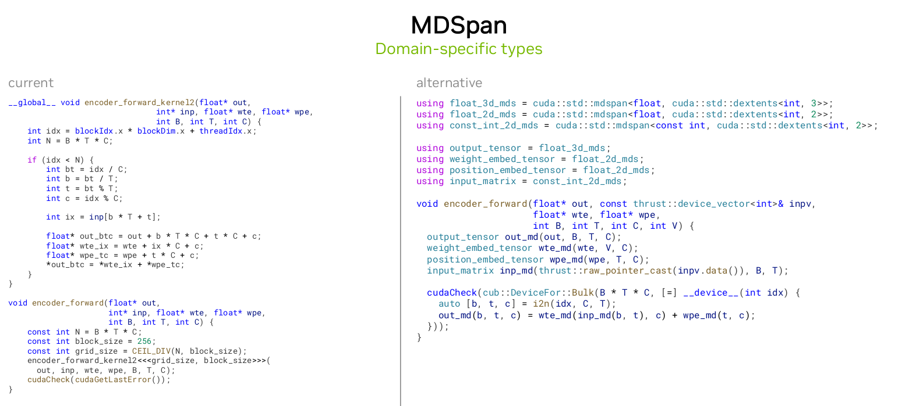

# CCCL的应用方法

这一节内容主要讲的是以llm.c为例，通过CCCL来优化coding的一些实例的方法。

## CCCL (CUDA C++ Core Libraries)

(CCCL)[https://github.com/NVIDIA/cccl]


其中Thrust、CUB、libcu++是CCCL的核心成员，一开始这三个库是分开开发的，目前是合并成为了一个总的库。在安装cuda-toolkit的时候已经同时安装了。


这三个库覆盖了在CUDA编程中从高级的抽象到底层的编码的过程中大部分问题，上图就是一个简单的表示，Thrust库其实是对CUB的一次包装，内部的算法都是CUB来实现的，Thrust库只负责了调用和封装。

## 使用范例

接下来展示了在具体编程过程中，Thrust、CUB、libc++、nvbench这四个库的具体用法，以及这么做的优点。

### Build System


首先从配置编译环境上来说，使用CMake有以下的几个优点：

- 更简洁，更易懂
- 通过CMAKE可以满足跨平台的需求
- 使用CMAKE来构建CUDA程序，会更加的安全。(如果没有指定cuda arch，就会有警告)
- 同时在安装依赖时也简单，可以通过CPM包来自动安装最新版的


### Memory Management


通过使用Thrust库在内存管理方面有以下优点：

- 类型安全.
- 更少的bug.
- 更通用.


在对数据进行搬运的过程中，cudaMemcpy是逐字节进行搬运的，并不会对数据类型敏感，在这个例子中，能够正常通过编译，但是数据类型并不匹配，所以会出现问题。


在这个例子中，出现的问题是由于隐式转换导致的，double类型的数据被隐式转换为int，在转换过程中数值出现了错误，但是使用thrust就可以避免这个问题。

最后一点是thrust库的易用性更高，一般在cuda编程中，cudaMalloc对应着cudaFree，很多情况下会忘记free操作，thrust库可以帮你做了这件事。

### Algorithm


在调用一些常用的算法时，thrust库往往会提供更多的类型安全的检查，减少bug的出现。比如在这个例子中，cudaMemset()接受的参数类型分别为void*, int, size_t,但是这里给的是float，这样的问题很难去check出来，使用thrust就可以避免这个问题。


同时在实现一些算法的时候，通过thrust库可以简化编码构思的过程。


同时thrust库是一个支持异构的并行框架，即同时支持cpu并行和gpu上的并行，如果想要通过cpu来完成计算，可以通过简单的加上这样一个宏来实现。
```cpp
// 用来开启openmp选项
#define THRUST_DEVICE_SYSTEM THRUST_DEVICE_SYSTEM_OMP 
```

在CUB库中还实现了对cuda api接口的高级抽象，让编码变得更加简单。

### Tuple


libcu++提供了gpu端的tuple类型。

### Fancy Iterators


提供了一下比较好用的迭代器。

### MDSPAN

 

提供了访问数据的视图的一种工具。


### atomic


对atomic原子操作进行了封装。


### Thread scope

Scope is a set of threads that may interact directly with given operation and establish relations described in the memory consistency model.

**cuda::thread_scope_block** is a set of threads of a given thread block

**cuda::thread_scope_device** is a set of threads of a given device

**cuda::thread_scope_system** is a set of threads of a given system

### NvBench


 

nvbench是一种用来寻找超参数的调优工具，与ncu不同的是，ncu对硬件的分析更加细致一些，但是nvbench可以对blocksize，gridsize，l2 cachesize等一些超参数的寻找会很方便。


## 最后

 

一些在编码中的建议。