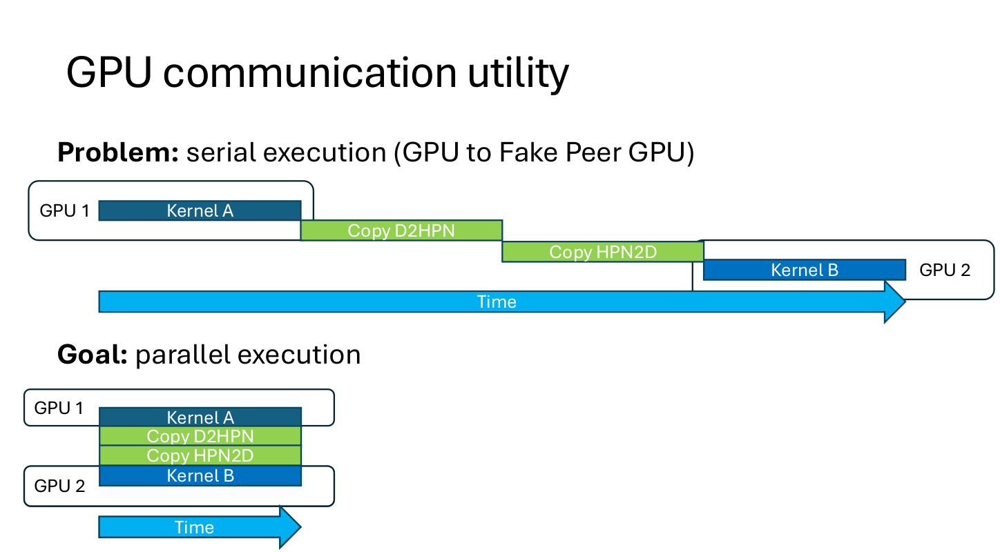
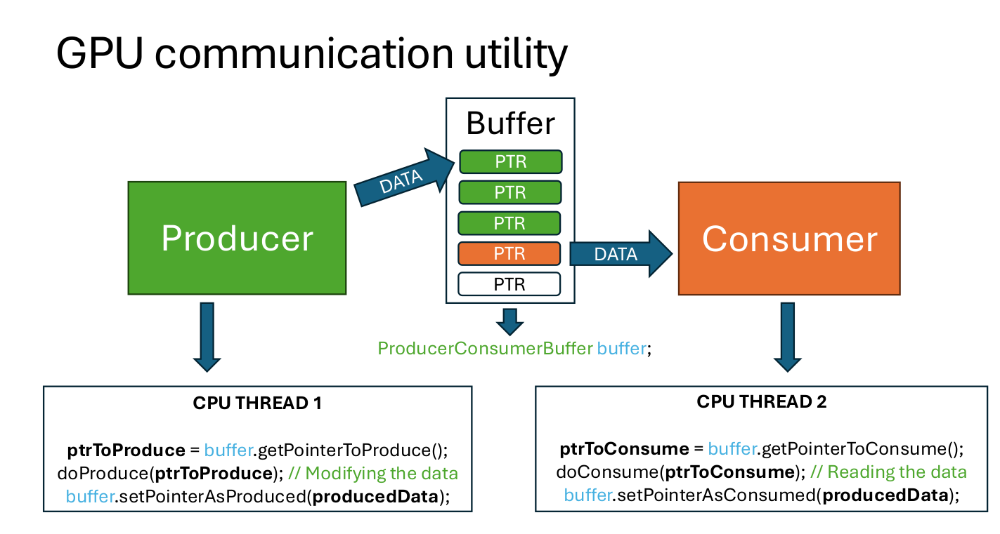

# Build a prod ready cuda library

针对在工程实践中GPU上的一些问题和解决方案进行讨论。

## GPU communication utility

从不同的位置上进行内存的搬运通过不同的路径，耗时也不同。

### Problem: serial execution(GPU to Fake Peer GPU)

在GPU之间去传输数据，传统的方法是这样串行化的去进行数据搬运，很显然这样会浪费很多的时间，不够高效。我们的目标是将数据的搬运和kernel的执行都并行化起来，当然这样听起来不太合理，因为数据之间还会存在一些依赖等问题。

在cpu上通常是通过生产者-消费者模型去解决这个问题的，划分一个数据的**缓冲区**，然后来分块的获取数据。使用这样的模型是为了避免对数据的竞争。
这个缓冲区中至少需要用**两个指针**来维护数据的读写。

 

这就是将cpu的解决方案用到GPU上的模型，在一个设备上通过两个指针来维护数据的竞争。每一次的迭代都按照以下的流程进行(ptr1~6 从上到下)：
1. 生产者kernel将数据写入到第一个ptr1      (on gpu)
2. copy D2HPN 将数据从ptr2读取，写入到ptr3 (from gpu to cpu)
3. copy HPN2D 将数据从ptr4读取，写入到ptr5 (from cpu to gpu)
4. 消费者kernel将数据从ptr6读取。          (on gpu)
5. 然后ptr1,ptr2交换，ptr3,ptr4交换，ptr5,ptr6交换。

每一次的迭代都要保证这些操作都完成(同步).

后面说的是通过一个iteration manager去管理这个迭代来优化整个过程，同时还基于生产者消费者模型，提出了一种Taker-Provider的模型。
但是这部分内容不开源，所以也没有怎么搞懂。

## 最后
关于GPU间通信还有NCCL (/nikl/)这个工具。
