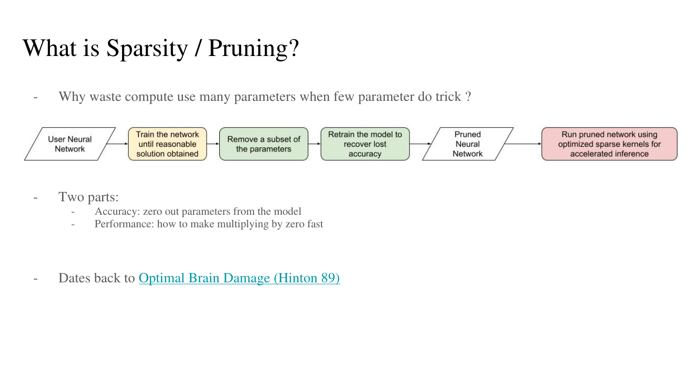
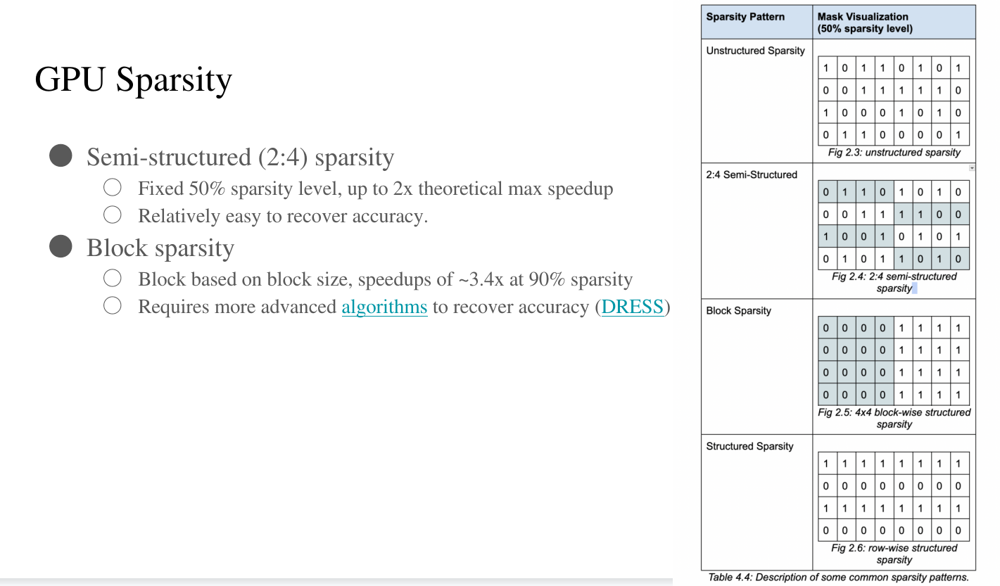
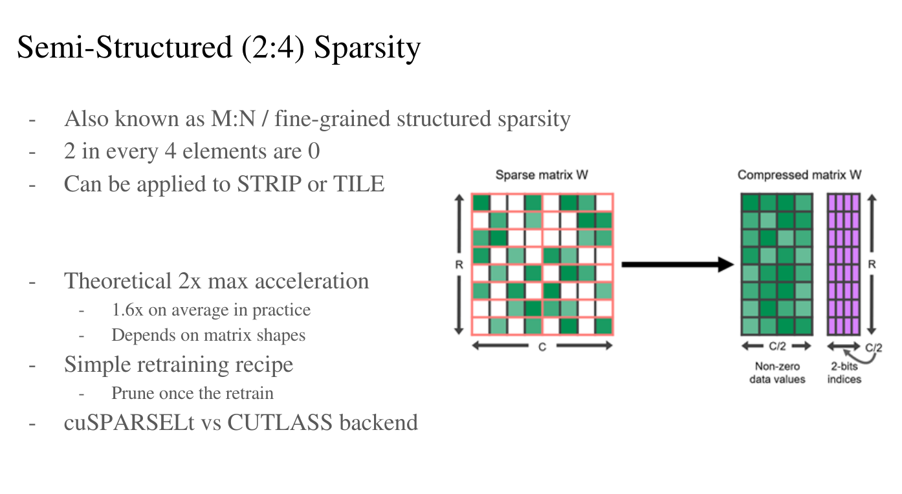
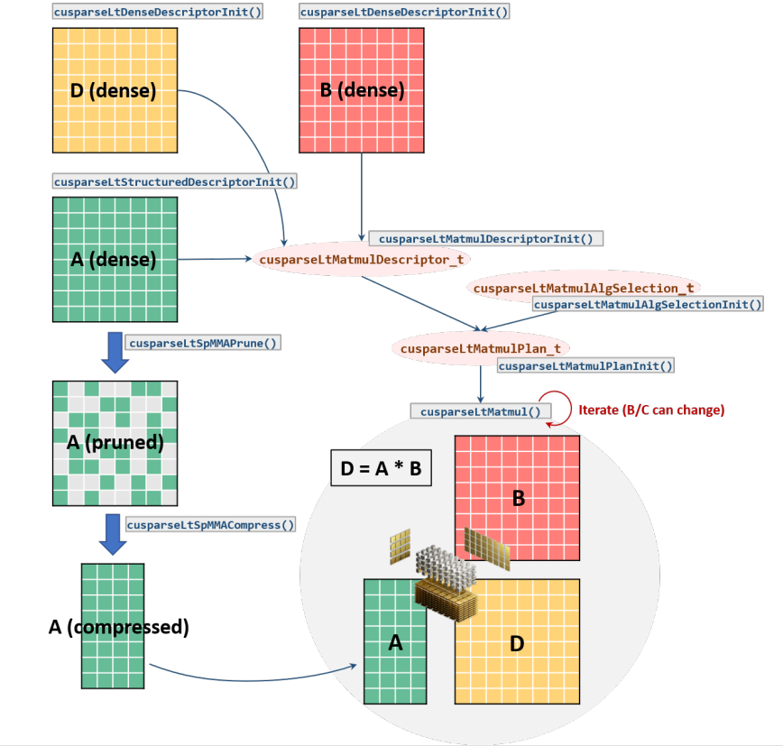
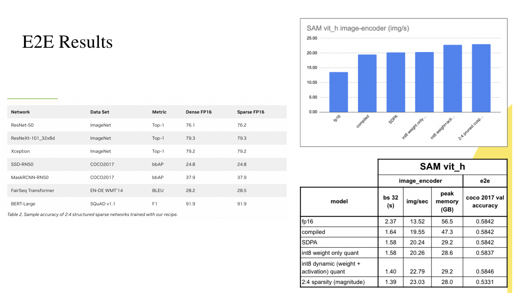
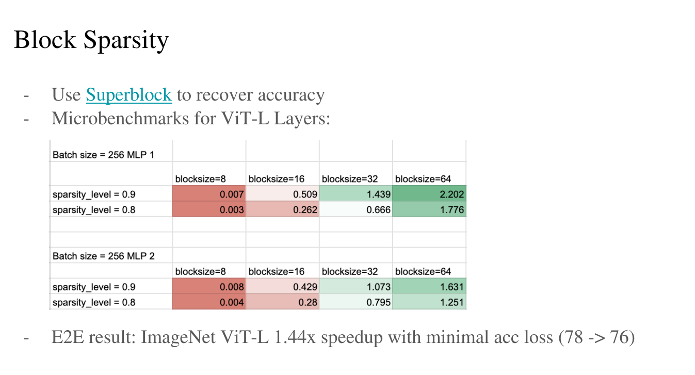
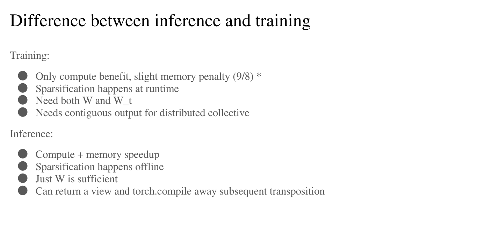

# Sparsity

这一节主要讲了矩阵稀疏化的方法和应用，以及在训练推理过程中的一些问题。

## Introduction

 

在训练和推理神经网络的过程中会有很多很多的参数来计算，但是只有一部分的参数真正的才遇到计算中。
剪枝的过程就是将神经网络中参数进行去除，然后重新训练这个网络来恢复网络的精度，从而得到剪枝后的网络。
这里的剪枝就是对矩阵稀疏化的过程。

去除哪些参数呢？从Optimal Brain Damage这篇论文中得到的结论是，先通过将一些数量级比较小的数进行剪枝，因为这些数的影响相对来说比较小。稀疏化就是基于这样一个基本的结论，对矩阵中一些很小的数据进行归零处理，从而降低计算过程中的复杂度，因为0乘以任何数都等于0。

## Sparsity(Performance)

.png)

我们想通过将一些数值变为0来对矩阵进行稀疏化，但是还想要保证准确性。

那么如何来对Tensor做稀疏化的矩阵乘法操作呢？

通过pytorch中的稀疏化表示(COO, CSR, CSC, BSR, and BSC)和 sparse kernels来完成。

或者通过稀疏乘法(只有个当矩阵高度稀疏时才会有提升)

## GPU sparsity

在gpu上做稀疏化面临着一些问题，对于非结构化的稀疏矩阵很难去做并行化，同时gpu是以block来组织线程的，很难对非结构化的稀疏矩阵进行这种block的划分。

所以为了在GPU行能够进行需要设计一些特殊的结构。

 

有两种结构化存储的方法，分别是Semi-structured (2:4) sparsity(半结构化)和Block sparsity(块结构)。

Semi-structured(2:4)sparsity：
- 固定的50%的稀疏等级，理论上最多有2倍的速度提升。
- 相对来说容易恢复精度。

Block sparsity:
- 基于块大小的块，在90%稀疏度下加速约3.4倍。
- 要求更高级的一些算法来恢复精度。

### Semi-structured(2:4) Sparsity

上面就是对semi-structured(2:4) sparsity的详细介绍。

 

这个是具体的计算过程，在对A矩阵完成剪枝之后，进行压缩，这里要保存一个mask为了梯度的反向转播。然后对压缩过的A矩阵进矩阵乘法。

左图是Nvidia通过稀疏化剪枝的方法对一些常见的模型进行优化后的结果。
右图是作者在SAM上进行稀疏化剪枝的结果。这个是对模型剪枝后进行微调训练后的结果。可以看出在一定的精度损失的前提下(当然这也在预料之内)，推理的速度得到了有效的提升。

#### pytorch sparse api

pytorch本身也提供了一些稀疏化操作的api。

### Block Sparsity

这个是通过Block Sparsity这种稀疏化的方法进行的实验，然后通过Superblock来完成的微调(恢复精度)。
(作者说这里还需要做很多工作)

## 2:4 Sparse Training

关于2:4 sparse 训练和推理过程中的一些区别。

