# Optimize optimizer

这一节中主要讲的是有关optimizer和cuda相关的内容，整体可以分为两个部分：
1. 通过加速pytorch中optimizer的过程引入的一个cuda的问题。
2. 上面说完了水平融合，接下来将竖直融合，通过torch.compile来优化optimizer。

## Part One
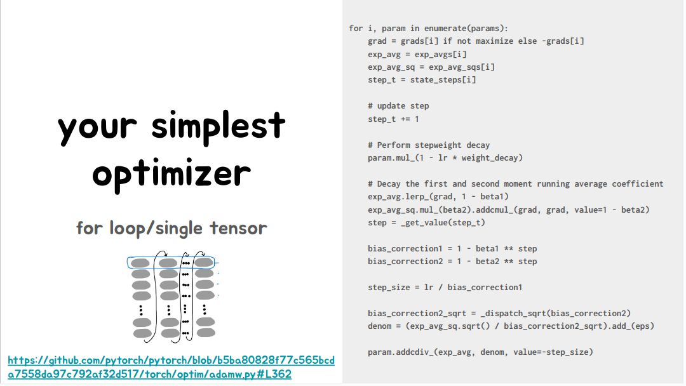

上图是optimizer的一般过程，输入是待优化的参数params，和参数对应的梯度gradients。
然后根据学习率lr去对参数进行更新(不同的优化器的实现细节不同)。
上图中所示的是Adamw的实现细节,其数学公式可以表达为：

$$
m_t = beta1 * m_{t - 1} + (1 - beta1) * grad 
$$

$$
v_t = beta2 * v_{t - 1} + (1 - beta2) * grad^2
$$

$$
\hat{v_t} = \frac{v_t}{1 - beta2^step} 
$$

$$
\hat{m_t} = \frac{m_t}{1 - beta1^step} 
$$

$$
param = param - lr \times \frac{\hat{m_{t - 1}}}{\sqrt(\hat{v_{t - 1}} + eps)}
$$

(其中m为一节动量，v为二阶动量)。

整个计算的过程如左下图所示，需要依次执行每个for循环，然后按照步骤执行其中的每个过程。如果对这个程序通过cuda来并行加速，这里考虑的是对计算的水平融合(Horizontally Fuse)。

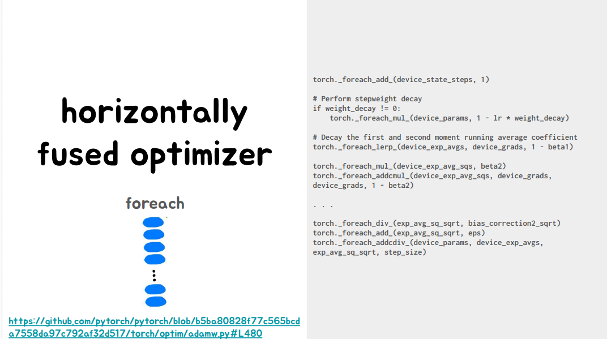
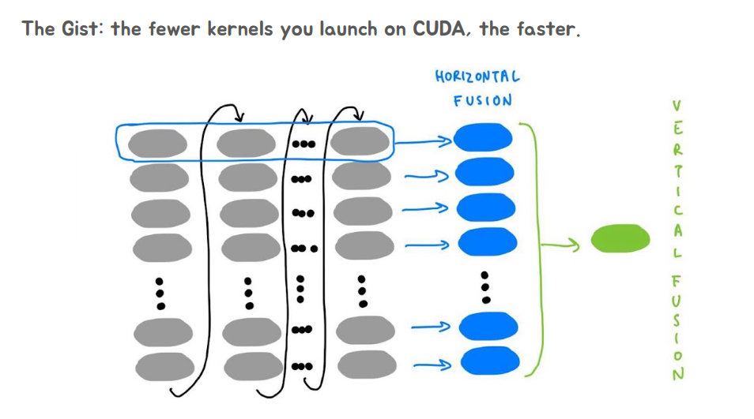

水平合并即将处于同一水平位置的相同的计算操作进行合并，将数据丢进cuda kernel中去并行的完成计算任务。如果不进行这样的合并，每个计算操作都要启动一个kernel去完成操作，但是kernel的启动时很耗时的，所以为了减少kernel的启动耗时，这里才去做融合。

所以现在要进行的是将很多个Tensor放到cuda中来进行并行计算的问题。
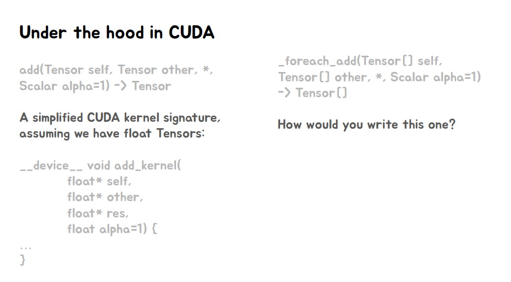

一般我们进行的操作是对一个Tensor进行并行计算，只需要将这个tensor的data\_ptr传入进来就可以进行访问，但是现在要进行的是对一个Tensor[]数组的搬运。所以这里就有一个问题，怎么把这个Tensor[]传入到Device(GPU)上。
这些Tensor之间的data\_ptr并不连续，所以不能像之前那个单纯的传入一个 dtype*的指针进去。

为了解决这个问题，展开了下面的讨论：

### Attempt 1

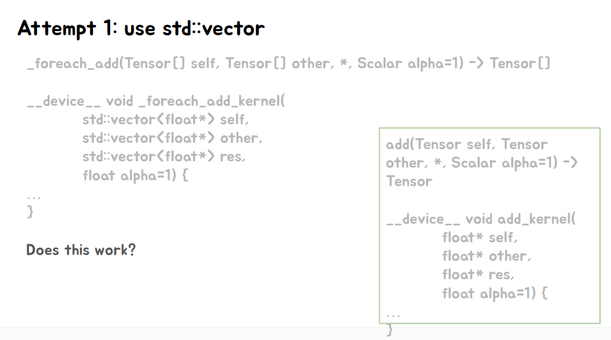
传入一个std::vector<float*> ? 显然是不行的，因为cuda kernel中并不支持std:vector。

### Attempt 2 

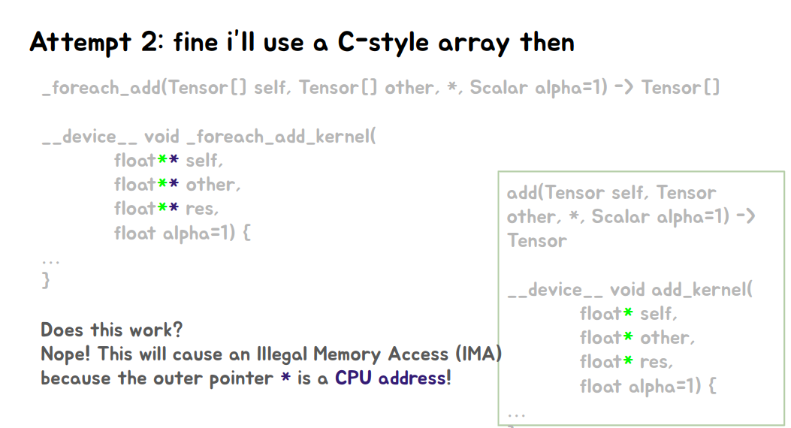

那是否能够传入一个像二维数组一样，传入一个二级指针呢？

比如: int* a[size]  中的元素可以通过 int** a 这样的方式来进行访问。 

data_ptr* a[size] (data_ptr是Tensor中的data的指针) 是否可以这样呢？

答案是否定的。因为此时指针的第二个*指向的是cpu中的地址。

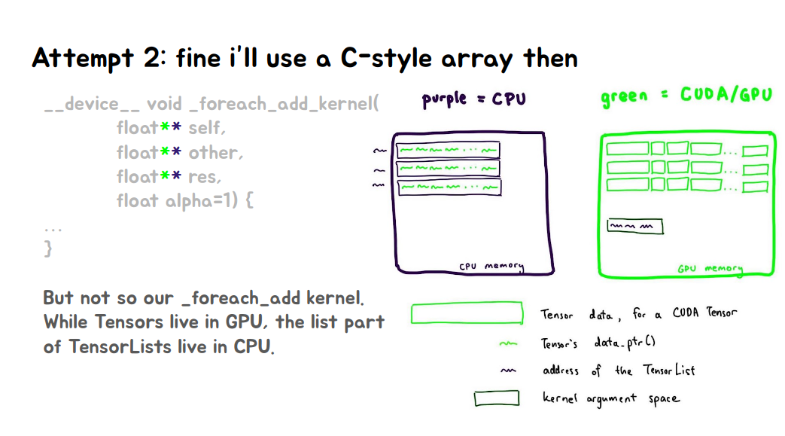

如上图所示，绿色部分是在GPU中的部分，data_ptr* a[]就是紫色框包住的绿色的部分，data_ptr*指向的是GPU中的空间，但是这个[]数组的指针，仍然是CPU上的，所以这里会发生非法访问。

### Attempt 3

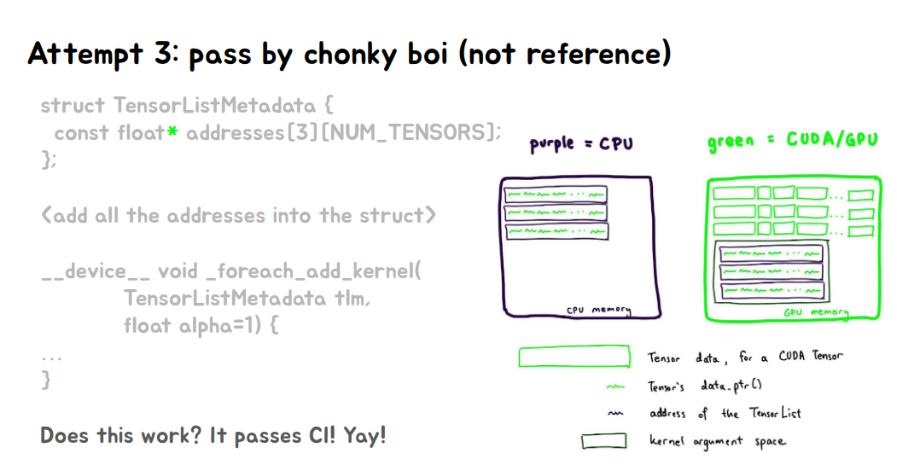

我们的目的是将Tensor[]传到GPU中，实际上，我们只需要将Tensor[]中每个Tensor的data_ptr传到GPU中即可，所以可以直接将这些指针打包成一个结构体，然后直接将这些指针传递进去。(直观上就是将这些地址放进一个数组，然后将这些数据memcpy到gpu上去，然后将这个TensorListMetaData*的指针拿到即可)。

但是很不幸这样还会发生问题，当Tensor[]的数量大过一定值的话，还会发生问题。为什么呢？
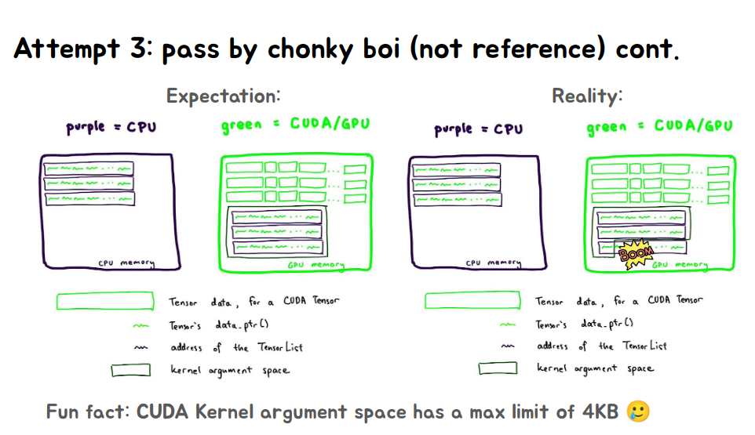

这里就要说一下 __global__ 修饰的kernel函数的启动过程了，在从Host调用kernel函数的时候，编译器生成stub函数，这些函数按值复制参数一次或多次，然后最终使用memcpy将参数复制到设备上的__global__函数的参数内存中。
这篇区域在constant memory中。

而造成上述问题的是因为kernel 函数的参数大小不能超过4KB。当Tensor的个数越来越多，TensorListMetaData*的size就会越来越大，导致问题。

(而在cuda 12.1从Volta架构开始，这个大小从4KB变为了32764bytes)

[Nvidia cuda-c-programming-guide](https://docs.nvidia.com/cuda/cuda-c-programming-guide/index.html?highlight=kernel%2520argument#global-function-argument-processing)

### Attempt 4

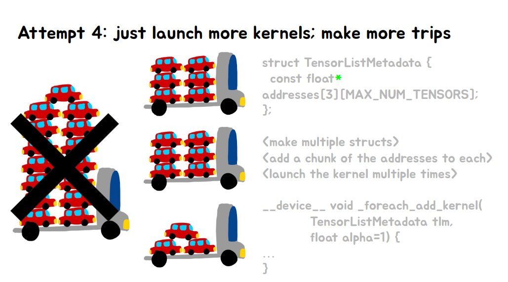

因为kernel function arguments的大小只有4KB，所以只能分批进行，每次对一部分的Tensor进行处理。

### Revisit attempt 2

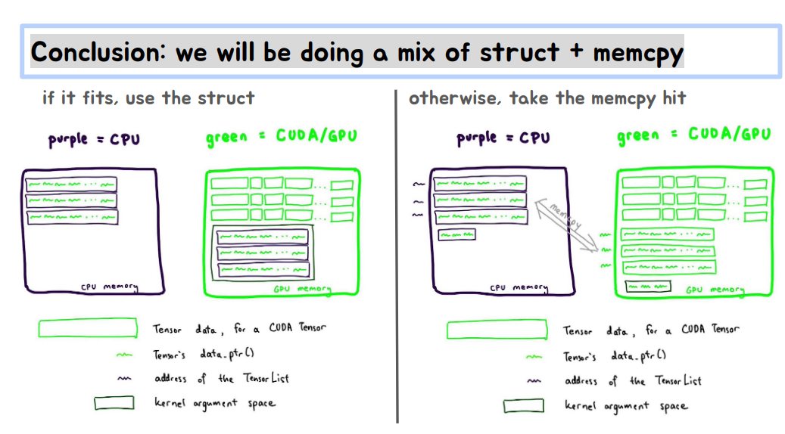

在这种问题上一般通用的解决方式，是将这些很大的参数列表(指针),直接包装在一个struct中，显式去将这一片内存中(保存的是date_ptr指针)通过memcpy拷贝到GPU的内存中去。

## Part Two

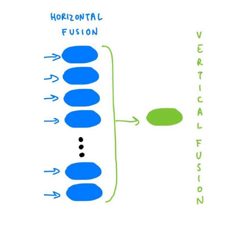

这一部分内容就是对计算过程中的算子的竖直融合。因为在算子的竖直融合中通过手工的方法会很麻烦，torch.compile可以解决这个过程，其内部通过分析计算图就完成了这个过程。

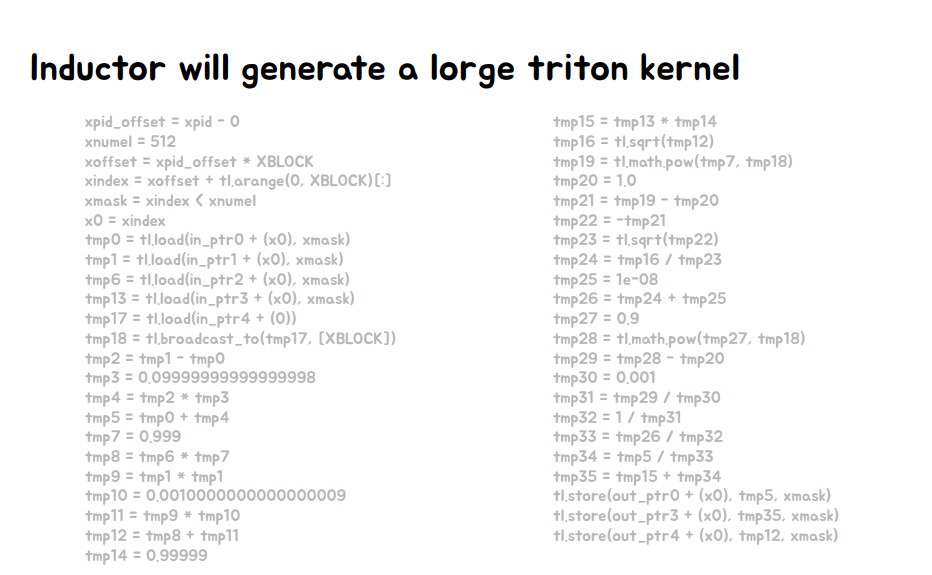

这个就是垂直融合后的算子的例子。

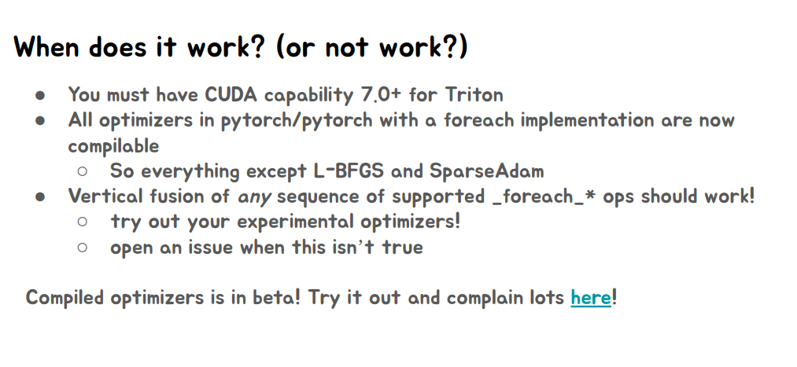
以及torch.compile适用的一些情况。
